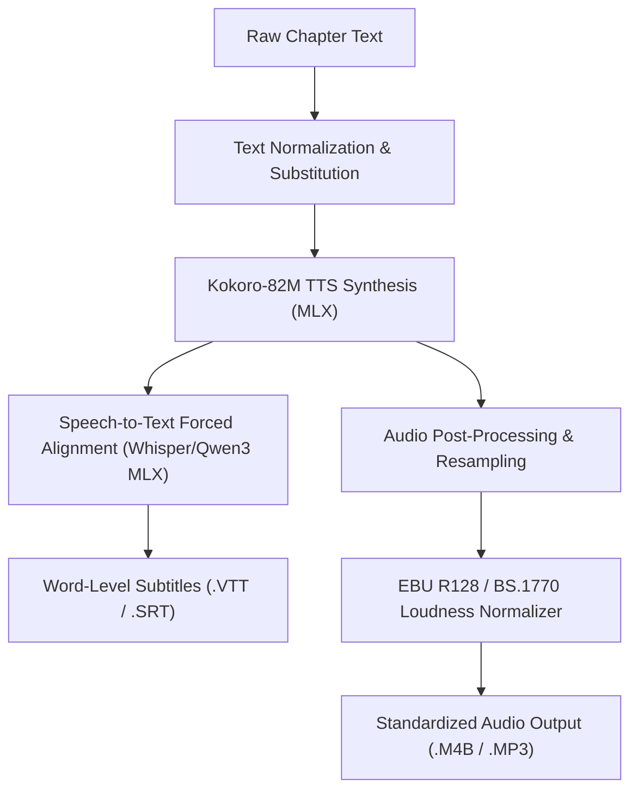

# Future Capabilities and Architectural Roadmap for MLX Audio

This document outlines the architectural roadmap for advanced audio and speech processing capabilities enabled by Apple Silicon MLX acceleration in **abogen**.

---

## 1. Overview and Architecture

The integration of `mlx-audio>=0.5.2` establishes local, unified memory inference for text-to-speech, speech-to-text, and audio signal processing on macOS ARM64. Future iterations will build upon this foundation to introduce zero-shot voice cloning, automatic subtitle timestamp alignment, and standardized chapter loudness normalization.



---

## 2. Zero-Shot Multilingual Voice Cloning (OmniVoice)

### Objective
Enable arbitrary voice cloning across 600+ languages from short reference audio samples (3 to 10 seconds) without model fine-tuning.

### Technical Specification
- **Engine**: OmniVoice integrated via `mlx-audio`.
- **Language Coverage**: Over 646 languages and dialects.
- **Reference Audio Input**:
  - Accepts WAV, FLAC, M4A, or MP3 clips.
  - Native loading and downmixing via `load_audio_mlx()` in `./abogen/tts_mlx.py`.
- **Pipeline Interface**:
  ```python
  from pathlib import Path
  from abogen.tts_mlx import load_audio_mlx


  def clone_voice_sample(
      reference_audio_path: Path,
      target_text: str,
      lang_code: str = "en",
  ) -> None:
      """Generate speech using reference voice characteristics."""
      audio_data, sample_rate = load_audio_mlx(reference_audio_path)
      # Pass audio_data as reference embedding to OmniVoice pipeline
  ```
- **Trade-Offs**:
  - Inference memory: ~2.5 GB unified RAM for 8-bit quantized models.
  - Speed: ~0.15 to 0.25 Real-Time Factor (RTF) on M-series chips.

---

## 3. Automated Word-Level Subtitle Alignment (Local ASR)

### Objective
Provide exact, phoneme- and word-level timestamped captions (`.vtt`, `.srt`) for audiobooks by performing forced alignment via local Automatic Speech Recognition (ASR).

### Technical Specification
- **Model Options**:
  - `mlx-community/whisper-large-v3-turbo-asr-fp16` (universal multilingual).
  - `mlx-community/Qwen3-Audio` (conversational and prosody-aware).
- **Alignment Mechanism**:
  1. Synthesized audio segments are processed through the local STT model with dynamic-time-warping (DTW) timestamp extraction enabled.
  2. Tokens and word boundaries are aligned against the original text chunks generated during chapter parsing.
  3. Formatted WebVTT output is produced with millisecond accuracy:
     ```text
     00:01:23.450 --> 00:01:25.120
     Synchronized audiobook narration.
     ```
- **Performance Characteristics**:
  - Whisper Turbo on Apple Silicon processes speech at ~100x real-time speed.
  - Generates zero network egress or external cloud API dependencies.

---

## 4. EBU R128 and ITU-R BS.1770 Loudness Normalization

### Objective
Standardize perceived audio volume across varying book chapters, character voices, and ambient dynamic ranges to prevent abrupt volume shifts.

### Standards and Targets
| Parameter | Audiobook Target | Permissible Range |
| :--- | :--- | :--- |
| **Integrated Loudness** | -18.0 LUFS | -19.0 to -17.0 LUFS |
| **True Peak Maximum** | -1.0 dBFS | Max -0.5 dBFS |
| **Loudness Range (LRA)** | 7.0 LU | 5.0 to 10.0 LU |

### Proposed Pipeline
1. **Measurement**: Two-pass filter measuring K-weighted loudness per ITU-R BS.1770-4 on float32 NumPy arrays.
2. **Gain Adjustment**: Apply linear scalar gain to achieve the target integrated loudness.
3. **Limiting**: Anti-aliased true-peak limiter to catch inter-sample peaks before AAC / ALAC encoding in `.m4b`.

---

## 5. Implementation Milestones

- **Milestone 1**: Dynamic sample rate and bit-depth configuration in GUI and WebUI settings.
- **Milestone 2**: EBU R128 loudness measurement filter integrated into the post-synthesis export phase.
- **Milestone 3**: Whisper Turbo MLX alignment engine added as an optional subtitle generator for converted books.
- **Milestone 4**: OmniVoice cloning tab in PyQt and Web interfaces with reference audio drag-and-drop.
